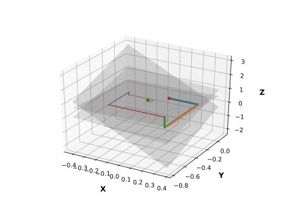

# Gauss Seidel

Python implementation of Gauss-Seidel algorithm to solve a 3x3 linear equation system.

Simply change the A matrix to your needs, run the script and the solution, along with a visualization of the algorithm will be outputted.

